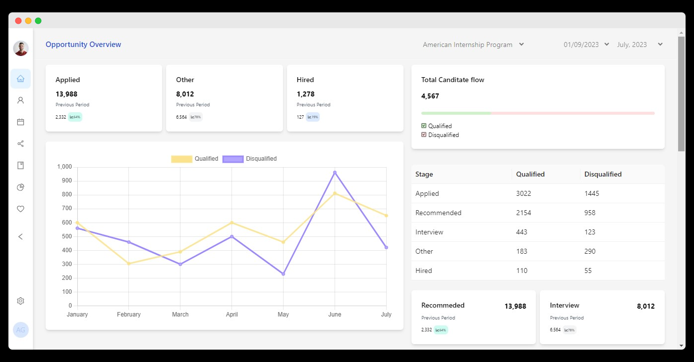

---

# Capital Placement Multipurpose Dashboard Task

A system that monitors and does proper documentation of user applications in the firm.

## Table of Contents

- [Screenshots](#screenshots)
- [Technologies Used](#technologies-used)
- [Icons](#icons)
- [Functionalities](#functionalities)
- [Getting Started](#getting-started)
- [Usage](#usage)
- [Contributing](#contributing)

## Screenshots

## Technologies Used

1. [Ant Design (AntD)](https://ant.design/): A popular React UI library for building web applications with a clean and modern design.

2. [Tailwind CSS](https://tailwindcss.com/): A utility-first CSS framework that simplifies building responsive and highly customizable web interfaces.

3. [React Chart.js](https://www.chartjs.org/): A JavaScript library for creating interactive and visually appealing charts and graphs in React applications.

## Icons

Icons used in the project are sourced from Ant Design Icons.

## Functionalities

### 1. Routing

The project includes routing between the home page and info page to view details of each firm's overview.

### 2. Tour Guide

At the beginning, a tour guide is provided to help users understand the features and functionalities of the application.

### 3. Line Graph

A line graph is used to display an overview of application data.

### 4. Tabular Representation

The application presents data in a tabular format for easy reference and analysis.

### 5. Local Storage

Local storage is implemented to track whether the user has completed the tour guide. It ensures that the tour guide is only shown once to first-time users.

## Getting Started

-Clone the repository by copying the link, on your terminal run git clone the (the link), the after cloning run npm install to install dependencies then finally npm start to run the project

## Usage

1. Monthly Application Tracking: With proper backend implementation, this project can be used to track the number of job applications received each month. This data can help organizations analyze trends, assess the effectiveness of recruitment strategies, and make data-driven decisions to improve their hiring processes.

2. Staff Documentation and Planning: The project facilitates the documentation of staff-related information, including applications, qualifications, and hiring status. This information can be used for workforce planning, identifying skill gaps, and ensuring that staffing needs are met.

3. Data-Driven Decision-Making: By visualizing application data through line graphs and tabular representations, users can make informed decisions. Insights from the data can be used to optimize recruitment efforts, allocate resources effectively, and improve overall efficiency.

4. Predictive Analysis: Over time, the project accumulates historical data on job applications. This data can be used for predictive analysis, such as forecasting future application trends, identifying potential recruitment challenges, and planning for workforce expansion or contraction.

5. Efficient Reporting: The project simplifies the process of generating reports related to job applications. Users can easily access and export data for reporting purposes, streamlining the reporting workflow.

## Contributing

1. Backend Development: Contributors can extend the project's functionality by creating a backend that connects to a database. This backend can handle dynamic data storage, retrieval, and processing, making the application more versatile.

2. Enhanced Tracking: Additional pages and features can be added to track other entities beyond job applications. For example, contributors can implement modules for tracking employee onboarding, performance reviews, or training programs.

3. Integration with External Systems: Integration with external systems, such as HR management tools or data analytics platforms, can be explored. This can enhance the project's ability to gather and analyze data from various sources.

4. User Experience Improvements: Contributors can work on improving the user interface and user experience (UI/UX) of the application. Enhancements may include responsive design, accessibility features, and intuitive navigation.

5. Documentation and Testing: Thorough documentation of the codebase, including API documentation if a backend is implemented, can aid both contributors and users. Additionally, contributions related to automated testing to ensure code quality and reliability are valuable.

--By expanding the project's capabilities and actively engaging with contributors, it can evolve into a powerful tool for organizations seeking to optimize their hiring processes and make data-informed HR decisions.
